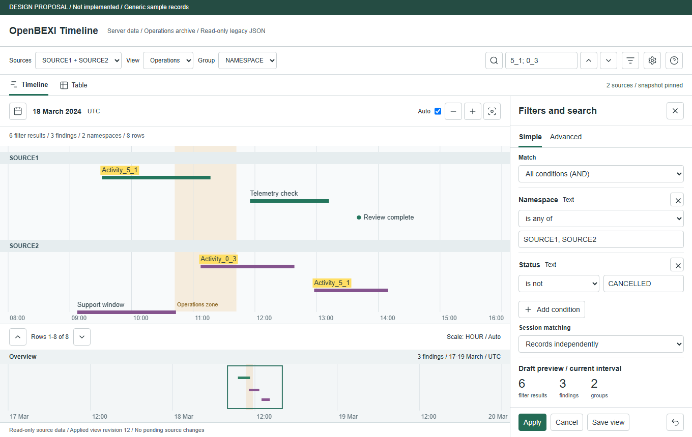
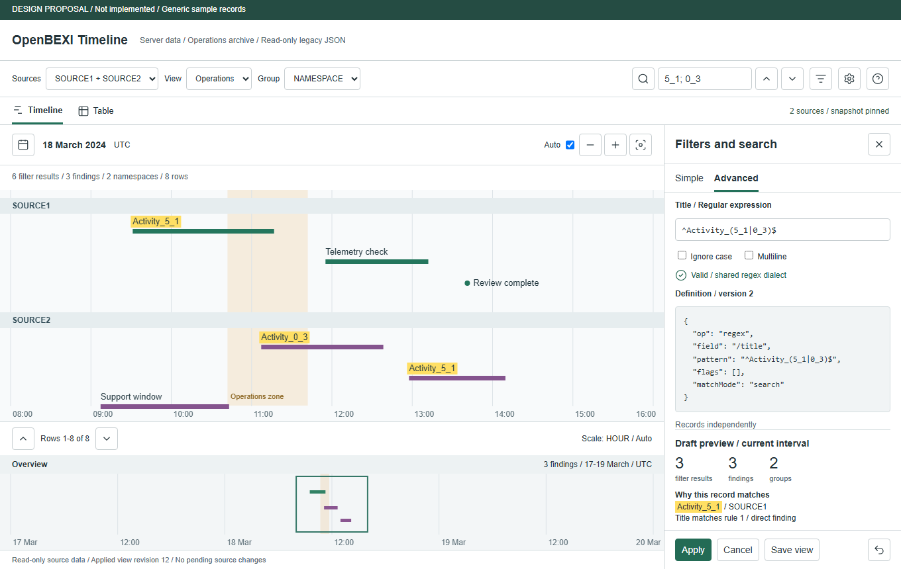
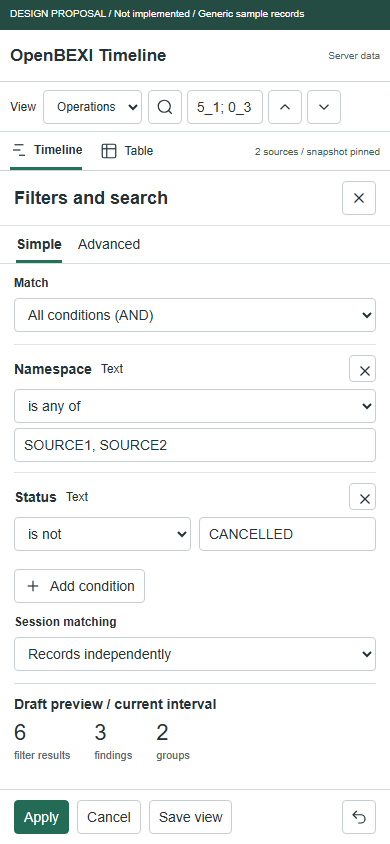
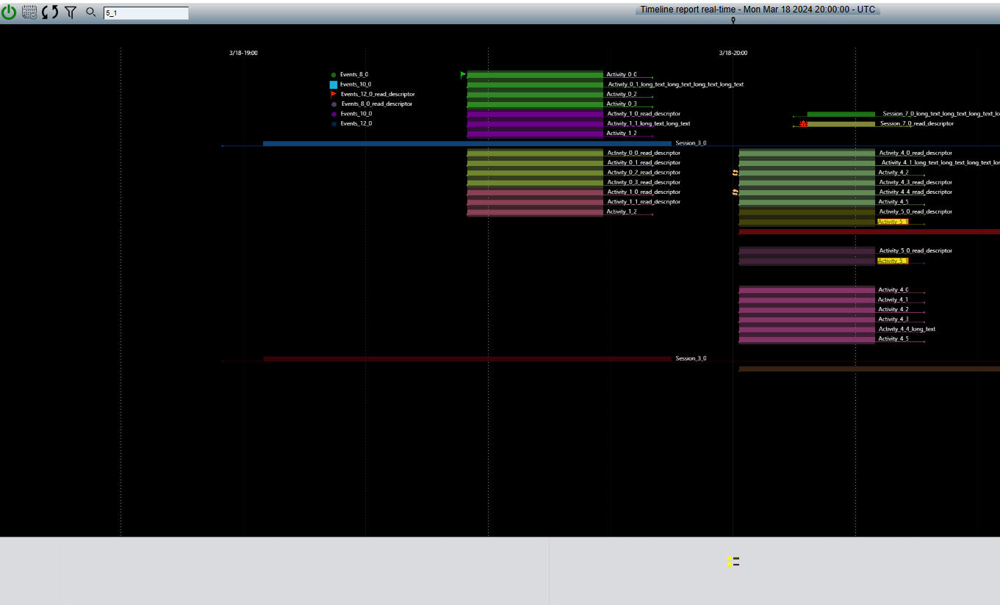

# OpenBEXI Timeline 2.0: Sorting, Filtering and Search

Revision 1.0 | 2026-09-14 | Implementation specification derived from a read-only audit.

**Status:** The audit, method probes and interface proposals are delivered. The features specified below are not implemented by this documentation change. Execute the four implementation phases only as an implementation task; do not interpret publication of this prompt as a qualified application release.

## Mission and Boundaries

Act as a senior reverse engineer, timeline interaction designer and Python/JavaScript engineer. Modernize legacy sorting, filtering and search without losing recognizable timeline behavior. Work in `C:/projects/open_timeline2.0`; inspect the actual legacy project at `C:/projects/openbexi_timeline`. Keep legacy JSON files strictly read-only.

Extend the existing application rather than replacing its architecture. Retain Python APIs, modular JavaScript with orthographic Three.js rendering, HTML/CSS controls, JSON-file persistence, and one provider contract for server and self-contained standalone operation. Do not introduce Tomcat, Java runtime dependencies, a relational database or a second query engine in the UI.

This focused specification preserves all unrelated requirements of [the rebuild prompt](OpenBEXI_Timeline_Rebuild_Prompt.md). It adds explicitly versioned regex and ordering capabilities without changing version-1 query semantics. It does not enable event/session CRUD against legacy sources. Existing editable canonical snapshots remain a separate capability, not a reason to rewrite legacy files.

Version the saved-view/query definition as well as its expression AST. New relationship/context, natural-order and regex behavior belongs to the version-2 workflow; existing version-1 requests and saved publications keep their original behavior, including their current ancestry rules. Migration or creating a new version-2 view is explicit. Negotiate query-definition, expression and engine capabilities separately rather than treating one version field as all three.

Preserve the main timeline above its synchronized overview, point markers, duration bars, measured labels, colored zones, right-side descriptors, table view, all supported date units and models, scale-dependent calendar navigation, smooth momentum, click-to-stop, limitless navigation within the supported date domain, source favorites, and accessible menus. Use generic events in new examples. Do not replace this experience with a task-table chart or a calendar.

The server resolves configured filesystem paths, including `/<path>/yyyy/mm/dd`. The browser selects server-known paths without a bearer-token form in the ordinary local workflow; this does not authorize unauthenticated remote filesystem access. Keep loopback defaults, origin protection and existing deployment authorization. Show path errors from the server and never expose arbitrary filesystem reads.

## Evidence to Reuse

Read [the analysis](docs/sorting-filtering/analysis.md), [source hashes and observed results](docs/sorting-filtering/evidence.json), [legacy method inputs](docs/sorting-filtering/cases.json) and [acceptance plan](docs/sorting-filtering/acceptance.md) before editing production code. Recheck source hashes if the legacy tree changed. Do not present a source inference as a full runtime observation.

The audit executed 14 unchanged Java method cases and six JavaScript checks. It found:

- `model.sortBy` creates groups/bands; it is not a conventional record-order setting.
- UI help advertises equality syntax that the inspected Java filtering path does not translate.
- Serialized-JSON regex can match child payloads and can append a parent twice.
- Search retains context and changes label color; some overview logic confuses authored yellow with a match.
- The legacy overlap test drops encompassing sessions and events exactly on the left boundary.
- A client lookahead-builder method exists, but the ordinary inspected call disables it with an empty string.
- Nonempty legacy YAML filters currently fail closed; canonical catalog support does not imply writable legacy preferences or a working legacy preview endpoint.

Preserve useful behavior, not eval, unsafe regex fallback, duplicate results, discarded boundaries, disabled-source loading, dummy-data fallbacks, color-derived matches or unannounced data loss.

## R1. Five Independent Concepts

Keep these concepts explicit in schemas, state and UI:

1. **Filter:** determines records eligible for the view.
2. **Search:** identifies findings and highlights them while keeping context by default.
3. **Group:** partitions eligible records into logical sections such as namespace.
4. **Sort:** orders records in the table and groups in the timeline; does not change time coordinates.
5. **Layout:** allocates collision-free physical rows using bars, markers, icons, labels and ancestry.

The quick Group selector offers ALL, NAMESPACE and registered custom scalar fields. ALL combines only the selected sources and disables grouping; it does not clear source restrictions or imply a filter named ALL. NAMESPACE is `/data/namespace`, not the source path or `/sourceId`. Several paths may share a namespace; one path may contain several namespaces. Support n namespaces without the legacy 15-value discovery limit.

A namespace is one logical group, not necessarily one physical row. Simultaneous sessions cannot share a row without overlap. Preserve compact readable packing and never squeeze text to fake a one-row result.

## R2. Exact Predicate and Ordering Semantics

Use registered JSON Pointer fields with type/schema metadata. Never evaluate a property path as JavaScript or match arbitrary serialized objects. Reject unknown fields and incompatible values with actionable diagnostics. Missing values, null, empty strings, zero and false are distinct.

Retain version-1 operators: `eq`, `ne`, `lt`, `lte`, `gt`, `gte`, `in`, `contains`, `exists`, `overlaps`, and nested `and`, `or`, `not`. Keep the current depth-eight, 100-node and typed-list limits unless a versioned, measured change is justified.

- Missing comparisons yield unknown; NOT unknown remains unknown. Only true selects a record. Null is present for exists, explicitly comparable with eq/ne, and unknown in ordered comparisons. The UI must offer separate Is missing, Is null and Has value choices.
- Numbers are finite and never coerced from strings. Booleans are not numbers. Dates use the existing parser and explicit offsets; order by instant, preserving the supported historical/extended-year domain. Query intervals are positive half-open intervals.
- Point event membership is `from <= start < to`. A duration overlaps when `start < to` and `end > from`; an open-ended session has an unbounded end for membership. A zero-duration session follows point membership. Clip drawing only, never source timestamps.
- Existing literal comparisons use NFC and the shared casefold table when case-insensitive. Do not silently replace them with browser locale collation. An array contains an exact typed member; scalar text contains a substring. No implicit array flattening, stringification or existential child matching.
- Ordinary table sorting retains one to three distinct scalar fields and ascending ID tie-break after user keys. Always sort the full selected scope before paging. Timeline row allocation remains deterministic temporal/footprint order, independently of table sorting.
- Keep version-1 codepoint ordering. Add an explicit version-2 natural-order option for strings: normalize NFC, optionally apply the same pinned casefold table, split ASCII digit runs, compare their numeric magnitude without floating-point conversion, then shorter digit run first for equal magnitudes. Compare non-digit runs by Unicode codepoints. Use the full normalized original string as the final text tie-break, then ID. Thus SOURCE1, SOURCE2, SOURCE10; numeric 2 and string "2" are not interchangeable.
- Present typed values precede null, which precedes missing in both directions. For mixed-type group fields retain explicit type ranks: number, string, boolean, null, missing. Descending reverses values within a present type, not the type/null/missing ranks. Array/object grouping or sorting requires a separately declared derived field; reject it otherwise.

Default migrated views use deterministic codepoint group order; offer Natural order clearly, with a preview before changing an existing saved view. Do not imply legacy encounter order was a stable sort guarantee.

## R3. Search, Sessions and Counts

Define the evaluation sets and publish their meanings:

- **U:** authorized records from selected/enabled sources, model/schema/kind restrictions, required per-source predicates and requested query domain.
- **B:** records from U satisfying the active saved filter AND transient filter, using the selected relationship mode.
- **M:** direct search matches within B, or B when search is inactive. Search is literal by default; regex is an explicit mode.
- **A:** authorized context ancestors needed to explain matched/eligible descendants. Ancestors cannot broaden source or authorization scope. They are not direct hits and do not count as filter results. Ancestors outside the temporal domain appear only as descriptor/breadcrumb metadata, not bars outside the requested view.

Default predicate mode is **Records independently**. A matching child remains selected and can show its ancestor from A; nonmatching siblings are not implicitly selected. A parent match does not automatically select descendants. Add an explicit **Keep family when any member matches** mode for legacy parent-retention intent: a direct predicate match admits that authorized family within U, with each member labeled direct or family context. Never override hard source/kind/domain restrictions or cross unrelated roots. Validate cycles, missing parents and duplicate identities.

Search always evaluates records individually after B is resolved. A match on a child highlights that child; its parent may show a descendant-match badge, not a false direct-match highlight. Explicitly document that default independent search corrects the legacy omission of parent fields. Preserve literal Any term, All terms and Exact phrase modes with their existing escape rules, selected fields and case behavior.

Main timeline defaults to B plus permitted ancestry context. Search matches have yellow label backgrounds and a non-color match indicator; authored colors return unchanged when search clears. The overview uses M when search is active, across the complete overview query domain, never just the visible row page. Zones remain visible regardless of search results. With no matches, show a zero-findings overview with its time range and zones intact.

The table offers Context and Findings explicitly. Findings export contains only selected direct search matches (and relationship provenance), not silently included ancestors or hidden siblings. Context export is a different labeled operation. Do not export unauthorized fields or record IDs in match explanations.

Count unique IDs, not rendered instances. Distinguish filter results, direct predicate hits, search findings, added context records, logical groups, physical rows and currently rendered items. Every count carries its temporal/source scope, query revision and completeness state. Never display a provisional count as an exact archive total. Preview counts refer to the draft; applied counts refer to the active query. Search explanations identify a bounded set of matching rule IDs and permitted fields, with HTML-safe snippets and an explicit truncation indicator.

## R4. Safe, Optional Regex

Add regex as an opt-in **version-2** predicate/search capability. Version-1 requests remain unchanged; unsupported versions/capabilities produce a clear error. Start with a documented RE2-compatible subset, pinned across Python and browser bindings. RE2 omits lookaround and backreferences; see [its syntax reference](https://github.com/google/re2/wiki/Syntax).

The proposed regex node is illustrative of the new contract, not accepted by the current API:

```json
{
  "version": 2,
  "root": {
    "op": "regex",
    "field": "/title",
    "pattern": "^Activity_(5_1|0_3)$",
    "flags": [],
    "matchMode": "search"
  }
}
```

Support literals, alternation, grouping, anchors, character classes and bounded/unbounded repetition within approved resource limits. Initial public flags are `i`, `m`, `s`; Unicode mode is always enabled internally. Reject duplicate/unknown flags, inline flag modifiers, lookaround, backreferences and engine-specific extensions outside the shared dialect. No `g`/`y` state or lastIndex. `search` means a match anywhere; `full` requires whole-field coverage with a real full-match operation or equivalently verified engine anchoring, not naive string concatenation of `^`/`$`.

Normalize subject text to NFC; preserve pattern text exactly rather than rewriting regex syntax. Regex case-insensitivity uses the pinned engine's Unicode rules, which may differ from literal full casefold. Document and test this distinction (for example sharp-s and dotted-I), along with astral symbols, combining marks, newlines, empty matches and anchor behavior. Return diagnostic offsets in Unicode codepoints; map normalized match spans safely to displayed text. Until span mapping is verified, highlight the whole label, not an incorrect substring.

Initial configurable ceilings: 512 Unicode codepoints per pattern, eight regex nodes per AST, 16 selected search fields, 100 total AST nodes, and bounded field/aggregate bytes under existing record limits. Compile once per query using a bounded cache keyed by pattern, flags, dialect and engine version. Define aggregate memory/work budgets and cancellation; large valid workloads return preparing/progress or a resource-limit error, never silently truncated findings. Empty regex is invalid; clearing search disables it. An explicit pattern capable of matching an empty string is allowed and reported as such.

Qualify the engine in a worker/isolate and the Python service before adoption. The [browser WASM binding](https://github.com/google/re2-wasm) is a candidate, not a mandated or already-qualified dependency. Confirm maintenance, pinned engine compatibility, notices, inline WASM loading, CSP, bundle size, browser coverage and file:// execution. Do not use native backtracking regex as a fallback, even on an error path. Reject unsupported patterns with a correction hint; never silently interpret them as literal text.

## R5. One Versioned Definition and Explicit Migration

Use one canonical typed AST as the source of truth for visual and advanced editing. The advanced editor shows validated structured JSON and field-scoped regex, not arbitrary executable code or a second ambiguous language. Toggling modes must preserve every node, stable rule ID, group, flag and unknown-draft error without changing results. Invalid drafts remain editable; Apply/Save are disabled and the currently applied timeline remains usable.

A saved view pins its definition version, schema/model publications, source selection, filter AST, search definition, relationship mode, grouping and group ordering, table sort/projection, and relevant presentation overrides. Distinguish draft revision from immutable publication version. Reuse current catalog lifecycle, revision guards, clone, publish, export/import and rollback patterns. Define exactly whether switching a preset replaces or preserves search/time; default preserves time and visibly applies the preset's saved search only when present. An explicit transient search override remains authoritative.

Import legacy presets and YAML filters through a **dry-run migration**, separate from data import. Preserve the original expression as metadata, show interpreted rules and sample differences, and require an explicit publication step. Use these classifications:

| Legacy input | Migration decision |
| --- | --- |
| Empty filter; NONE grouping | Exact empty predicate; combined selected-source view. |
| `sortBy: namespace` | Map to registered `/data/namespace`; report deterministic ordering change. |
| Simple `field:value` | Resolve an approved field and preserve observed matching intent where possible; report serialized-object versus typed-field differences. |
| `field=value` help syntax | Offer equality as an intent repair, not an exact legacy translation; require acknowledgement. |
| Semicolon/plus/pipe expressions | Parse only an unambiguous supported legacy grammar; display AND/OR/NOT tree and changed results. Do not split regex operators naively. |
| Generated positive/negative lookaheads | Offer structural include AND NOT exclude when equivalence can be established; do not execute lookaheads. |
| Nested-object matching or parent retention | Offer explicit family mode and show child/parent count differences. |
| Ambiguous, unsupported or malformed regex | Block publication with location and alternatives; no silent dropping, broadening or native fallback. |
| Nonempty per-source YAML filter | Keep fail-closed behavior until an approved scoped predicate exists; never ignore it while marking the source ready. |

A per-source rule contributes `(source = X AND sourcePredicate)` to the source union; selected-source union is then intersected with saved and transient filters. Excluding records from SOURCE1 must not also exclude identical values in SOURCE2. Validation occurs before enumeration; no preview or count may leak data outside the effective authorized source scope.

Preserve legacy sources byte-for-byte. Store new presets, favorites and model overrides in a separate application-owned JSON directory configured by the global YAML. Use atomic replacement, locking where needed, schema validation, optimistic concurrency and restrictive path resolution. Never put those files in source date partitions. Local standalone settings and imports must not imply synchronization with server preferences; provide explicit portable export/import and conflict handling. No database is introduced.

## R6. Easy, Predictable Interface

Keep the compact legacy-style menu and visible timeline. Integrate improvements into existing controls rather than adding another permanent toolbar. After Settings retain Help and sharing. Provide source favorites/multi-selection, a saved-view selector, Group, search field, Find previous/next, and a Filters control with an active count. Use familiar icons with accessible names/tooltips for actions, proper selectors for choices, tabs for views, and checkboxes for binary options.

The filter panel opens in Simple mode. Show friendly field names plus a type indicator; use typed inputs, suggestions from the authorized scope, explicit case controls and AND/OR groups. Keep advanced JSON/regex behind an Advanced tab. Retain applied query state while a draft is invalid or a preview is preparing. Provide Apply, Cancel, Reset draft, Undo and Save view with clearly distinct effects. Undo restores the previous applied query, search, grouping and source selection without moving the temporal focus; it does not roll back source data.

Preview is bounded and cancellable, includes direct/context counts and a few safe examples, and does not navigate the timeline. Show active top-level conditions as removable summaries; removing a summary must remove exactly its represented subtree and preserve nested logic. Do not flatten an OR expression into misleading independent chips. Suggest corrective actions for no matches without automatically weakening a filter.

Find next/previous traverses all findings in stable time/ID order across vertical pages, not only loaded items. It may explicitly navigate to the finding's interval and page while preserving scale policy. Show the selected record's descriptor and why it matched. Clearing search restores authored styles and the ordinary overview without resetting source selection, filters, zoom or group order.

Counts and progress use accessible status announcements without stealing focus. Restore focus when dialogs close, trap focus only in modal dialogs, support keyboard editing, and keep touch controls usable. Honor reduced motion. Avoid color-only meaning and inaccessible raw JSON as the only explanation. Follow [W3C status-message guidance](https://www.w3.org/WAI/WCAG22/Understanding/status-messages.html).

## R7. Stable Rows, Time Mapping and Loading

Compute density from the complete B for the relevant query range, independent of search, collapsed groups or the current vertical page. Preserve a single monotone time-to-position mapping per band for markers, bar endpoints, zone edges, axes and selection overlays. Indicate local magnification boundaries and factors. Manual zoom/magnification controls and an auto-scale toggle remain available.

Optimize for readable packing and reduced rows where horizontal expansion can help. Simultaneous items still need separate rows. Preserve temporal focus with hysteresis; page changes must not trigger remapping. Group collapse changes visible row allocation only; it does not change membership, density or overview findings. Keep collapsed group state keyed by typed group identity and saved-view revision.

Allocate the full query's deterministic row layout before row paging, with stable IDs and a pinned layout revision. Capacity is based on actual available height and measured row spacing. A large group may span pages; repeat its header as a presentation-only continuation with no duplicate record count. Reserve continuation-header space in capacity calculation so every page progresses. Never orphan a header as the only page content. Keep the time axis, zones and overview fixed while changing vertical pages.

Reuse existing query-session and layout APIs and their asynchronous preparation lifecycle. Add preview/definition capabilities through explicit schemas and version negotiation; do not overload a forbidden legacy mutation endpoint. A query identity binds data/source revision, authorization generation, filters, search, relationship mode and domain. A layout additionally binds map, presentation/model revision, width, font metrics, grouping/collapse and row capacity. Cursor identity also binds ordering/projection. Reject stale or mismatched cursors instead of skipping/duplicating records.

Requests include visible/domain intervals, selected paths, typed predicates, search, sort/group choices, capacity/cursor and display profile where relevant. Responses identify exact versus preparing/partial coverage, scoped counts, revisions, continuation cursors and matching/context metadata. Detailed main records, lightweight overview and density summaries may be separate, but must bind the same query snapshot. Live updates offer Refresh; they must not silently reorder a pinned page. Revoked authorization invalidates cached data immediately.

Start the URL and application shell without scanning all history. Display the selected real source with a truthful loading state, not a default test flash. Prioritize the visible span and a small bounded past/future prefetch. Extend lazily during panning, cancel obsolete work and ignore old responses. Keep previous valid geometry while replacement data prepares, clearly indicating stale/partial coverage.

Correct overlapping-session retrieval cannot rely solely on start-day folders. Use an application-owned JSON interval index, verified partition summaries or an explicit supported source duration/coverage contract to discover sessions starting earlier. Cache/index building may be incremental, but do not claim exact complete results until relevant coverage is established. Without sufficient metadata, report preparation/incomplete coverage; never silently drop long sessions. Do not block shell startup on archive-wide indexing.

Drag rendering is frame-based and independent of request completion; use bounded motion, velocity estimation and deceleration rather than per-event reloads. A pointer-down stops momentum without accidentally selecting an item. Keep drag/selection thresholds, overview navigation, descriptors and keyboard behavior consistent with the audited listener intent. Navigation is not clamped to currently loaded records; prefetch is a bounded cache, not the navigable time domain.

## R8. Server and Standalone Parity

The same provider contract must resolve filters, search, relationships, ordering, zones, overview, density, revisions and pagination in both modes. Renderer and UI must not select different query semantics based on provider type. Extend existing modules and shared fixtures; do not duplicate a whole standalone application.

The generated `dist/index.html` includes JavaScript, Three.js, styles, fonts/assets, regex runtime if enabled and a complete initial dataset. It opens directly through file:// without a Python process, CDN, runtime module download or local-data HTTP request. Import complete legacy JSON via picker/drag-drop with existing format normalization and diagnostics. Large local files either remain completely browsable within published limits or fail clearly; never keep just a server page and label it a snapshot.

On backend failure, use a complete local snapshot with source and timestamp displayed, preserve temporal state where valid, and offer controlled reconnect. Do not silently replace the selected source with unrelated sample data. A saved filter referencing absent fields, sources or unsupported capabilities must remain visible with a resolution error; never quietly discard restrictions. Keep startup connectivity timeout distinct from the existing server query-preparation timeout. Any new timeout defaults require measured tests, not conflicting values in different documents.

## R9. All Models and Real Sources

Create a model-coverage ledger for all seven production legacy models plus the test-page model listed in the audit. Re-run dry-run mapping against actual files. Preserve supported units, colors, bands, heights, labels, zones, nesting, baselines, namespace/source styling, inspector fields and model publication/version rules. Report unsupported settings individually; do not call a partially mapped model fully supported.

Qualify combined SOURCE1/SOURCE2 and NAMESPACE views, with explicitly selected/enabled paths; one-path/many-namespace and many-path/one-namespace cases; earthquake/volcano sources; and bundled local datasets. Use read-only real files and controlled test copies, not production mutations. Verify `yyyy/mm/dd` boundaries, earlier/later navigation, empty days, long sessions, descriptor loading, invalid records and inaccessible roots.

## R10. Four Implementation Phases

1. **Stabilize CI and async assumptions.** Repair immediate-200 query/layout test helpers using bounded same-identity polling, audit similar helpers and add deterministic delayed-preparation coverage. Confirm all supported platforms pass without skipping authorization assertions. Do not hide races with arbitrary sleeps, reruns or reduced coverage.
2. **Implement compatibility and UX.** Freeze schemas and expected-ID fixtures first; qualify the regex engine; implement migration, application-owned preferences, provider parity, simple/advanced editor, match metadata, grouping and saved views. Validate real sources and every model. Record each corrected legacy deviation. Finish exact functional and screenshot checks before performance claims.
3. **Measure and optimize.** Profile cold/warm startup, visible data, query cancellation, row packing, dense scaling, continuous navigation and standalone import. Optimize observed bottlenecks without weakening completeness or safety. Record hardware, fixture hash, limits, p50/p95 and failures. Keep previously published performance gaps visible until retested.
4. **Qualify and release.** Run the full unit, integration, browser, accessibility, source-read-only and platform matrix on the exact candidate SHA. Inspect desktop/mobile captures and Three.js pixels/geometry. Update README/screenshots/demo, docs/API/schema versions, migration notes, GPL notices and limitations. Only then tag the agreed preview version, publish artifacts/checksums and verify the hosted demo matches the qualified artifact. Do not bypass protected branch checks or describe an analysis commit as a release.

## R11. Test and Acceptance Gates

Follow the detailed [acceptance plan](docs/sorting-filtering/acceptance.md). New tests must assert IDs, order, grouping and counts, not just screenshots. Pair each legacy probe with an explicit preserve/correct/migrate decision. Golden outputs must be reviewed independently of the implementations under test.

- Unit: typed truth tables, null/missing/arrays, NFC/casefold, dates and boundaries, natural ordering, pattern diagnostics, resource limits, parent cycles, migration ambiguity and AST round trips.
- Integration: identical local/real-HTTP IDs, counts, errors, complete cursor traversal, density/map hashes, grouping, complete-snapshot export/import and authorization. Include HTTP 202, timeout/cancel, stale responses, changed source files and immutable saved versions.
- Browser: Simple/Advanced round trip, preview/Apply/Cancel/Undo, keyboard workflow, source favorites, findings navigation across pages, right-side descriptor, zero findings, continuation headers, mobile overflow, offline startup/import/reconnect and reduced motion.
- Rendering: sparse/dense/simultaneous data, labels/icons/bars, crossing sessions, overlapping zones, custom namespaces, all model units, search-only overview, manual/adaptive scaling and rapid horizontal/vertical navigation. Check nonblank Three.js canvas pixels, moving geometry and zone alignment at desktop and mobile widths.
- Integrity: before/after hashes of legacy JSON/model/YAML inputs; no writes to source partitions, no raw private records in logs/artifacts, no regex fallback, no source/authorization leakage in previews/facets/explanations.

Report exactly which gates ran, passed, failed or remain untested. A successful build, method probe or design screenshot alone does not prove implementation parity. Do not claim a perfect release or unlimited scale.

## Proposed Interface

These are documentation-only design proposals with generic data, not captures of implemented features. The light timeline remains a model choice; existing model-specific palettes are preserved. Screen content/counts are illustrative, not measured query outputs.

### Simple Filters and Contextual Search



The compact menu retains source selection, grouping, search and Settings/Help. Friendly rules, preview counts and explicit Apply preserve the active timeline while editing.

### Advanced Rules and Match Explanation



Regex mode and its validation are explicit. Context, findings and group counts remain distinct. The advanced representation is the same versioned definition, not another query language.

### Mobile Filters



On a small screen the editing sheet uses the available width; it does not compress timeline labels into unreadable rows. Actual keyboard, touch and accessibility qualification remains a Phase 2/4 gate.

### Historical Visual Reference



Supplied legacy screenshot; capture provenance is unverified. It illustrates search presentation, not an exact output oracle. The report distinguishes it from new-application captures of legacy datasets.

## Deliverables for the Implementer

Provide scoped application changes, shared/versioned schemas, migration ledger, safe engine qualification record, reviewed golden fixtures, passing provider and browser tests, real model/source comparison captures, updated Markdown/PDF instructions, performance evidence and a release checklist tied to the exact commit. Keep this prompt's proposed screenshots labeled until replaced by verified application captures. Preserve GPL-3.0-only project licensing and third-party notices.
