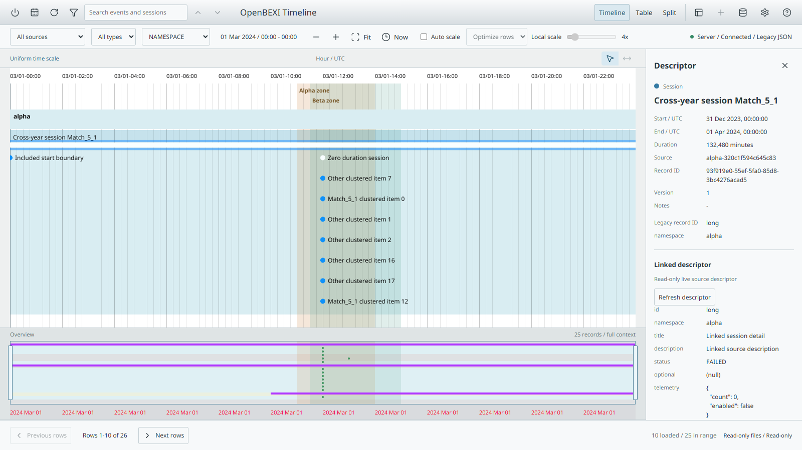
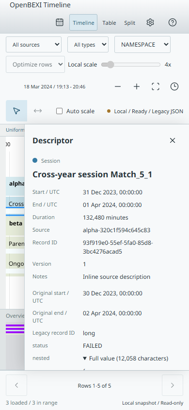

# Sorting, Filtering and Descriptors

Implementation candidate, September 2026. This document describes the new code, not a stable-release certification. The original [acceptance plan](acceptance.md) and [legacy method evidence](analysis.md) remain authoritative historical evidence.

## Use the New Workflow

1. Open Filters and explicitly select Query definition Version 2. Existing version-1 views retain their original semantics.
2. Choose typed conditions in Simple mode or edit the same Boolean tree in Advanced mode. Search highlights findings without removing the surrounding filter results. Regex is optional and field-scoped.
3. Choose independent matches plus parent context, or matching families. Counts distinguish direct predicate hits, retained family records, search findings and added ancestor context.
4. Preview the draft, then Apply. Invalid expressions keep the applied query intact. Cancel discards the draft; Undo restores the previous applied filter state.
5. Save the current filter as a draft in the configuration manager, explicitly publish it, then save the view against that exact publication. Review a saved view before applying it. Model and filter publications are immutable pins, not moving latest-version references.

The table supports natural or codepoint text ordering, case sensitivity, multiple sort keys, Context or Findings projection, and its own page size. Version-2 views preserve these settings. Namespace group collapse changes visible row allocation only; density, time mapping and overview findings remain unchanged.

## Legacy Descriptors

Selecting a marker, session bar or text label opens the right-hand descriptor, as in legacy `ob_open_descriptor` and `ob_createDescriptor`. The record's title, dates, original dates, legacy identity, namespace and other metadata are available immediately. Empty descriptions automatically trigger the existing server-side sidecar lookup using the selected record's trusted source provenance.

The panel handles missing files, bounded timeouts, retry, changed selection and closing while a response is pending. Nested values, null, zero and false remain inspectable; long values expand without being discarded. Parent navigation and query explanations expose only context authorized by the pinned query. Search findings are explicit metadata, never inferred from authored yellow colors.

Intentional safety improvements: descriptor values are text, not executable HTML. Legacy custom descriptor JavaScript is not evaluated. Missing/null fields remain inspectable rather than being silently hidden. Standalone snapshots show their complete embedded metadata but do not read external server sidecars while offline.

## Read-Only Sources, Writable Preferences

Legacy JSON, model, descriptor and YAML authorities remain read-only. The YAML launcher defaults `server.preferences_root` to a dedicated `preferences` child beneath `server.state_root`; setting it to null disables preference writes. A custom preferences directory must remain a dedicated child of that application state root, outside all legacy authorities.

Only application-owned filters, views and personal/default settings are writable there. Imported legacy catalogs must be duplicated before editing. Source, schema, model and event/session mutation endpoints remain forbidden in legacy mode. The application never uses a source's date partitions for preferences.

Preferences use an independently revisioned, checksummed JSON document, exclusive locking, atomic replacement, optimistic revision checks and retained idempotency outcomes. Query preparation captures the preference revision before asynchronous work starts, independently of the data revision. The current store admits 16 MiB and 256 command outcomes; it fails explicitly at capacity rather than pruning recovery history silently.

Offline edits remain local. Complete snapshot export preserves personal view ownership with a local-only principal marker; that marker is never server authentication. A snapshot timestamp does not imply that later server records are included or that preferences synchronize automatically.

## Contracts

- Query `definitionVersion: 2`; expression `{version: 2, root: ...}`. Version 1 rejects the new operators and ordering extensions.
- Safe regex dialect `re2-common-v1`: pinned RE2JS and google-re2 engines, no native backtracking fallback. See [qualified syntax, Unicode restrictions and budgets](regex-qualification.md).
- Query-bound descriptor: `GET /api/v1/workspaces/default/query-sessions/{id}/records/{recordId}`.
- Next/previous finding: `POST /api/v1/workspaces/default/query-sessions/{id}/find`.
- Read-only migration review: `POST /api/v1/workspaces/default/query-sessions/{id}/legacy-filter-migration`.
- The [generated OpenAPI](../../shared/openapi.json) includes request/response schemas, provenance, diagnostics, explicit version gates and pagination metadata.

Migration does not execute legacy patterns or automatically publish a repaired filter. Ambiguous syntax, unknown fields and unsupported regex remain blocked. Advertised legacy equality syntax is marked as an intent repair; the UI requires acknowledgement and a separate Apply. Required per-source predicates need an explicitly approved version-2 AST and a matching hash of their original configuration before source enumeration; a rejected required predicate never broadens access.

## Executed Evidence

- [T01-T15 fixture](../../shared/fixtures/sorting-acceptance-v2.json): frozen, reviewed canonical IDs normalized through the real legacy reader. Local/HTTP tests assert exact membership, context, counts, overview order, zones and complete pagination.
- [Eight-model ledger](model-coverage.md): per-property runtime adaptation and catalog migration disposition, with source hashes. Runtime adaptation is not a claim that every historical setting or pixel is equivalent.
- Descriptor browser tests cover sidecar lookup/retry, safe text, stale responses, keyboard selection, expanded metadata and mobile bounds. Inputs are checked byte-for-byte after use.
- Preferences integration tests hold query preparation open, mutate preferences, then verify the query still uses its original preference revision in both eager and lazy legacy modes.
- `scripts/profile-sorting-v2.mjs` records a reproducible 10,000-record development-machine profile. Observed grouped layout medians are about 460 ms; these are not browser frame-time or p95 acceptance results.

Run the full candidate verifier after all edits stop:

```sh
python scripts/verify-candidate.py --matrix --output artifacts/verification/sorting-v2-candidate
```

The verifier binds evidence to an unchanged source inventory and includes the offline two-browser regex oracle. Individual passing suites do not replace an exact-commit platform matrix.

## Actual Candidate Screenshots

These are unmodified application captures, not visual proposals. Both use generic synthetic records from the descriptor integration fixture, with no private source data. They show the tested candidate bundle in Edge 153.0.4234.32 at device-pixel ratio 1. The [capture manifest](../ui/sorting-v2/screenshots.json) records the exact bundle, fixture and image SHA-256 values, viewport sizes and capture provenance. The source tree still contained uncommitted candidate changes when captured.

### Desktop Descriptor



At 1600 x 900, selecting the cross-year session opens its right-hand descriptor alongside the main timeline and synchronized overview. The linked sidecar contains generic status, namespace, null and nested telemetry values, including zero and false. Source records remain read-only; visible row pagination does not hide the overview.

### Offline Mobile Descriptor



At 390 x 844, the same application opens a complete imported snapshot directly from the local filesystem. The descriptor retains original dates and embedded metadata, including an expandable long value. The Local status remains explicit; no external server-side descriptor lookup is implied by this offline image.

## Remaining Gates

No stable release is certified here. Remaining gates include five real usability participants, manual screen-reader tasks, controlled browser p95/RSS/cold-start distributions, every historical interaction/model variation, and production deployment/durability qualification. The model ledger lists individual unsupported or substituted settings rather than claiming complete model fidelity.

Raw legacy JSON/YAML still enters standalone mode through the explicit Python conversion/export workflow; the browser file picker accepts complete canonical snapshots, not arbitrary filesystem paths or a crawl of sidecar folders. Lazy archive coverage remains provisional until older partitions are verified. These limits are not removed from the modernization target.
