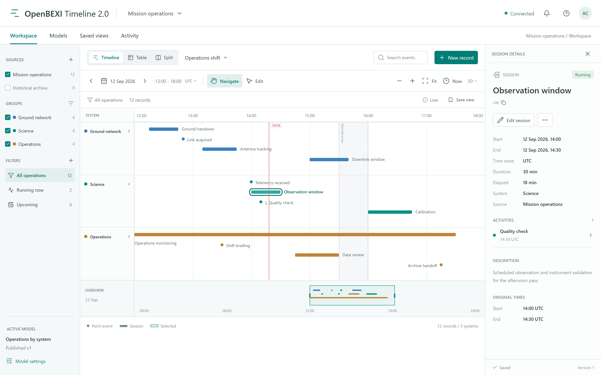
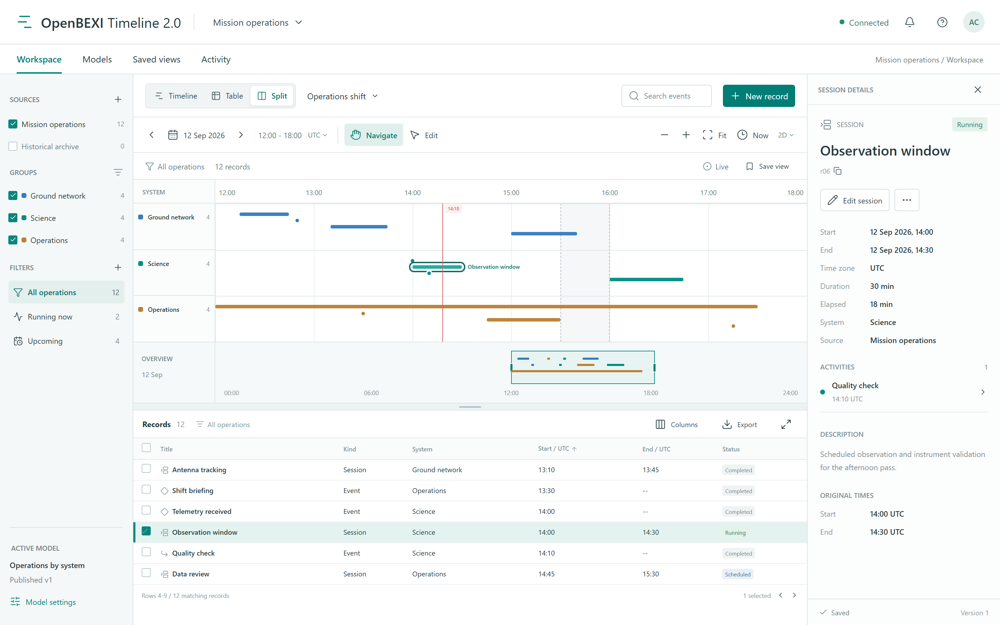
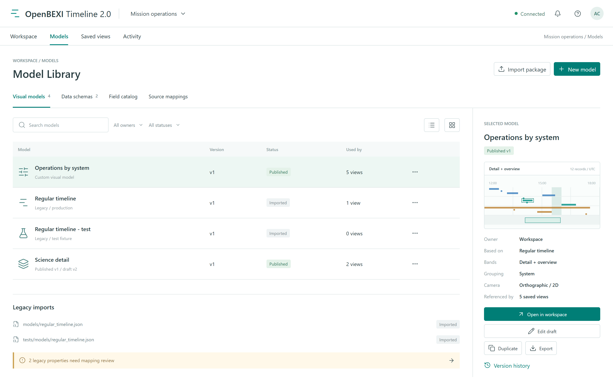
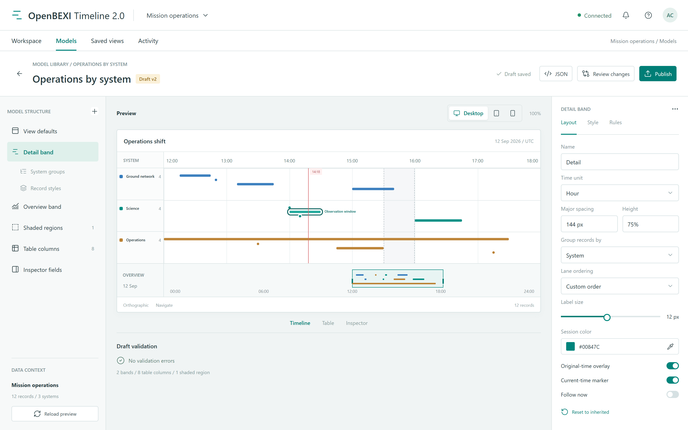
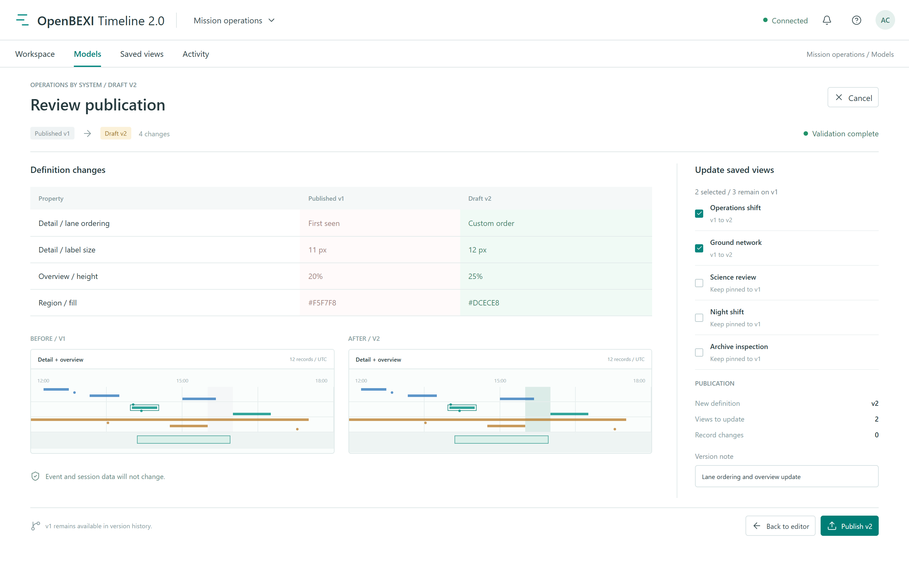
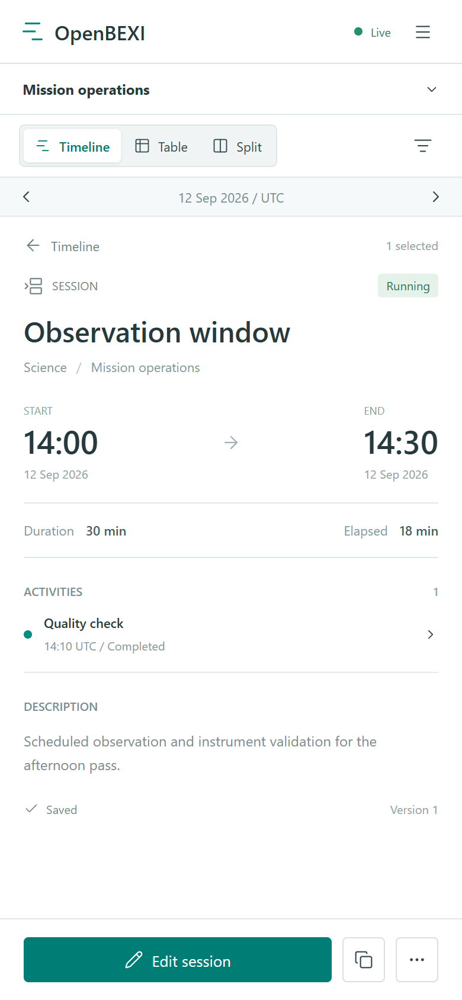
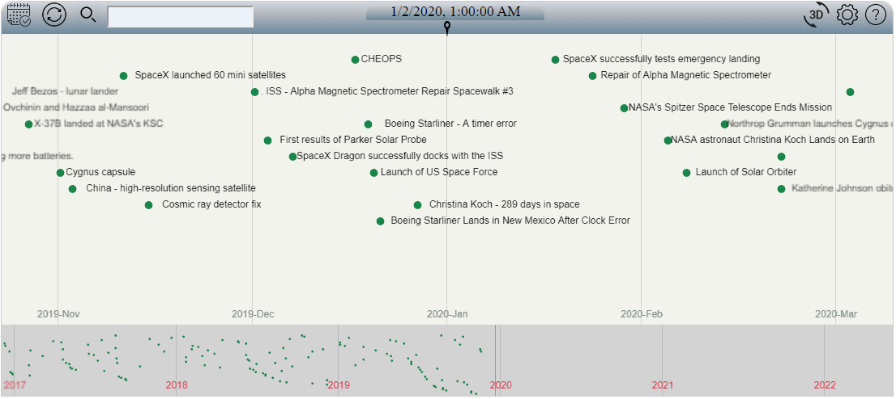

# OpenBEXI Timeline 2.0: Proposed UI

Revision 2.1, 12 September 2026. These are screenshots of static design mockups, **not an implemented or tested application**. They are embedded in the main Markdown specification and PDF. Controls, validation badges, connection states and import results illustrate intended states only. No application source was generated for this task.

The previews were rendered deterministically with Playwright and headless Microsoft Edge from temporary document-rendering markup outside the project. Icons use Lucide. Desktop captures use 1440 x 900 CSS pixels and mobile uses 390 x 844, at device scale factor 2. The source specification governs behavior; future implementation screenshots must be captured separately from the real application.

## Screens

### V01: Timeline

Default Navigate mode, selected session, inspector and synchronized overview. Dragging a record pans time without saving dates.

### V02: Split

Shared filter, selection and canonical records. Six visible rows of 12 matches; rows sort by start then ID. Compact chart labels prioritize the selected record to avoid collisions.

### V03: Model Library

Distinct production/test imports, model types, status, versions and references. Import badges and mapping messages are illustrative, not audited migration outcomes.

### V04: Model Editor

An isolated draft with structured controls, JSON editing, validation and preview. The draft chooses a custom lane order: Ground network, Science, Operations.

### V05: Publication Review

Explicit model-version publication and two selected reference upgrades out of five; no event/session mutation. Miniature before/after panels are schematic composition previews using one common time context, not measured render comparisons.

### V06: Narrow-screen Inspector

The same session and activity in a readable single-pane layout with persistent actions.

## Fixture

Mission operations, 12 September 2026, UTC. Detail viewport 12:00-18:00, overview 00:00-24:00, reference clock 14:18. Record aliases below are concise display labels, not canonical UUID examples. Each system has four records. Two are Running and four Scheduled. The selected record is r06; its finite duration is 30 minutes and elapsed time is 18 minutes. All times below are on the same fixture date.

| Alias | Title | System | Start | End | Status | Parent |
| --- | --- | --- | --- | --- | --- | --- |
| r01 | Ground handover | Ground network | 12:15 | 12:45 | Completed | None |
| r02 | Link acquired | Ground network | 12:50 | Point | Completed | None |
| r03 | Antenna tracking | Ground network | 13:10 | 13:45 | Completed | None |
| r04 | Downlink window | Ground network | 15:00 | 15:40 | Scheduled | None |
| r05 | Telemetry received | Science | 14:00 | Point | Completed | None |
| r06 | Observation window | Science | 14:00 | 14:30 | Running | None |
| r07 | Quality check | Science | 14:10 | Point | Completed | r06 |
| r08 | Calibration | Science | 16:00 | 16:45 | Scheduled | None |
| r09 | Operations monitoring | Operations | 12:00 | 17:30 | Running | None |
| r10 | Shift briefing | Operations | 13:30 | Point | Completed | None |
| r11 | Data review | Operations | 14:45 | 15:30 | Scheduled | None |
| r12 | Archive handoff | Operations | 17:15 | Point | Scheduled | None |

Workspace screenshots show published Operations by system v1. The editor/review show a draft v2, retaining the same records and time. The publication example affects Operations shift and Ground network; Science review, Night shift and Archive inspection remain pinned to v1. Maintenance is a 15:30-16:00 annotation, excluded from the 12-record total. Design plates illustrate states across the workflow, not simultaneous evidence from a live service.

## Historical Reference

This separate image is copied without alteration from [legacy documentation at the pinned commit](https://github.com/arcazj/openbexi_timeline/blob/cf5d263853e550aab44d3d1959637c1e324b719e/doc/openbexi_timeline_space_exploration.PNG). It was not captured during this audit and is not a proposed successor screenshot. Retain upstream OpenBEXI attribution and applicable repository license notices.
