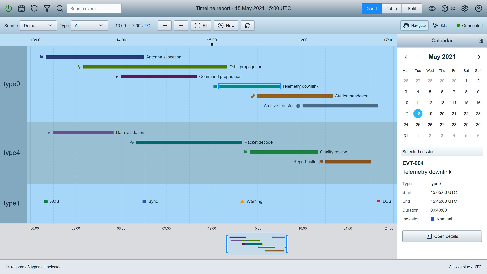
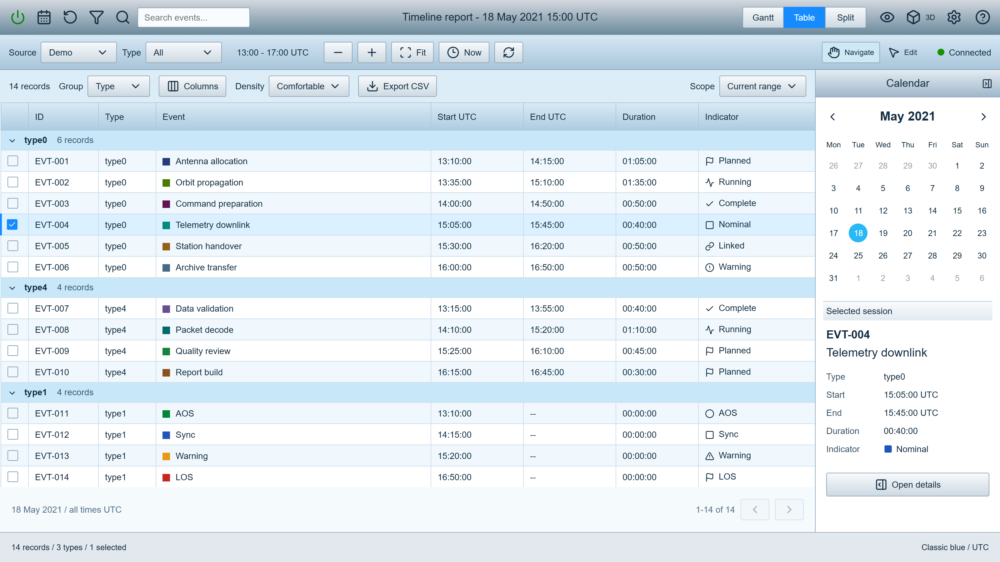
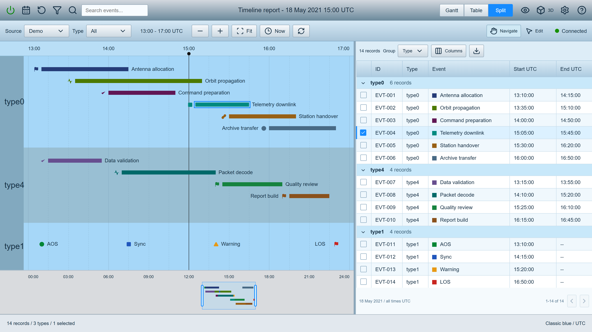
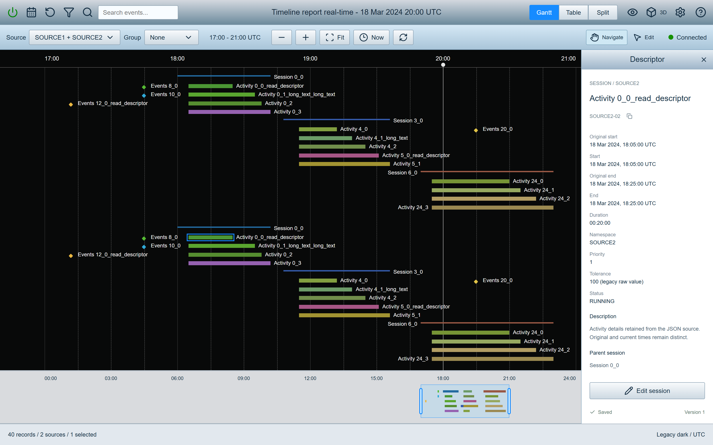
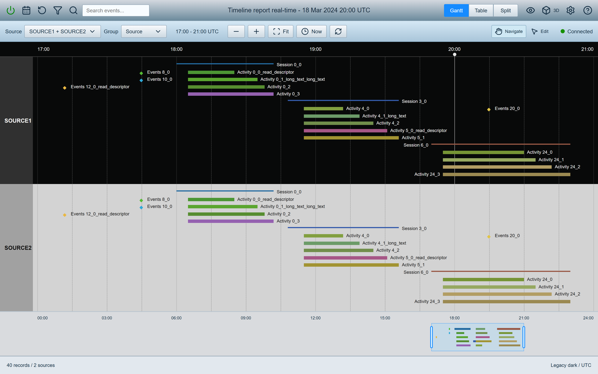
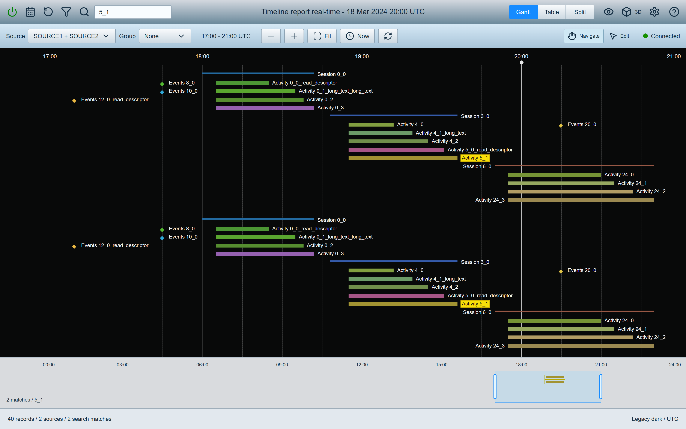
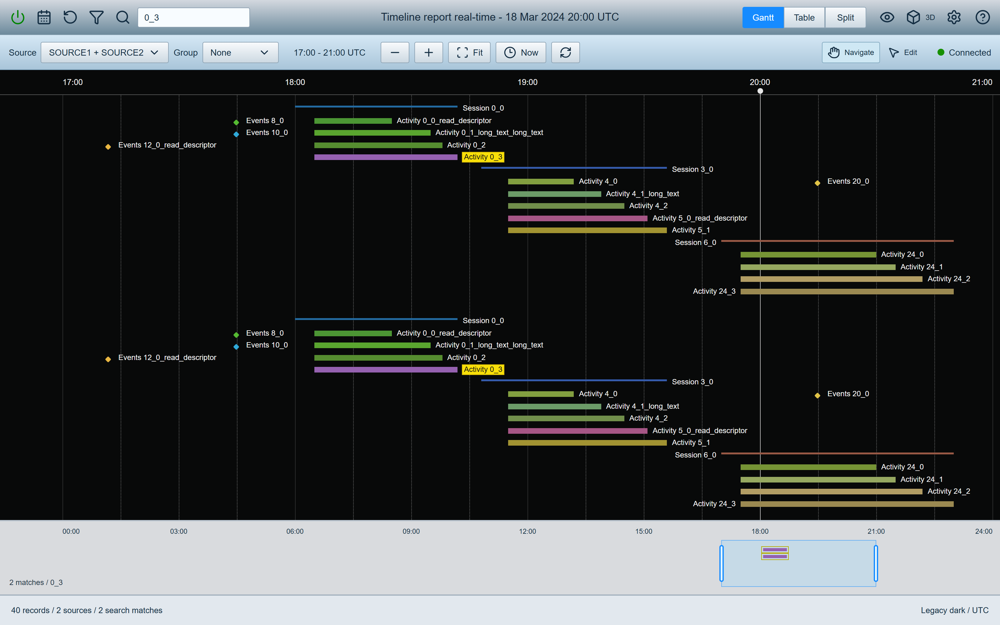
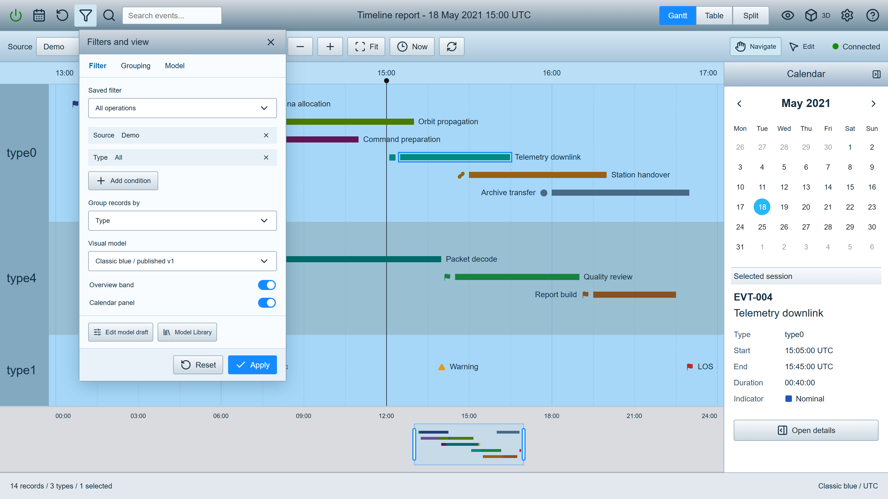
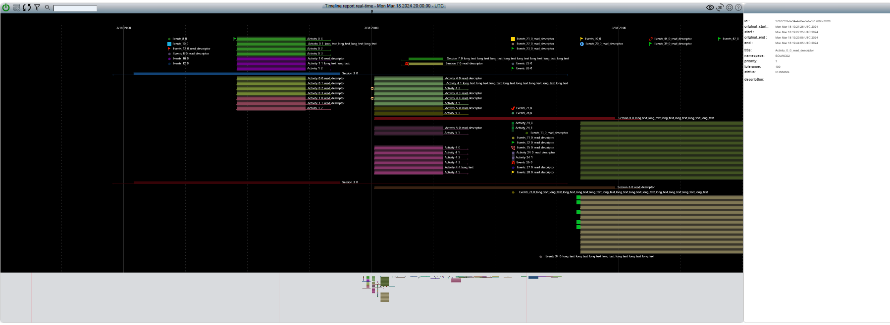
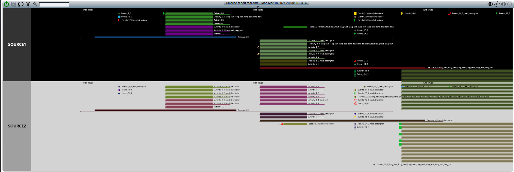

# OpenBEXI Timeline: Legacy-Aligned Visual Targets

Revision 2.2, 12 September 2026. The eight proposed screens below are **static document-design mockups, not an implemented application**. The three evidence images later in this file are unaltered user attachments. The main Markdown specification and PDF embed all eleven, plus the existing historical repository image.

The default visual direction now follows the complete 17-page `OpenBEXI_Timeline_Rebuild_Prompt_legacy.pdf`: metallic compact toolbar, blue grouped bands, thin colored bars and point glyphs, reference marker, right calendar/descriptor, light overview and equivalent Table shell. Black/neutral configurations remain first-class models, as demonstrated by the supplied screenshots. Revision 2.1's dashboard-like default is superseded, while its model-management workflow requirements remain.

## V01: Classic Blue Gantt

1600 x 900 CSS pixels. Exact 14-record May 2021 fixture, types 6/4/4, EVT-004 selected, reference time 15:00, real timestamp-derived positions and a 14-record overview. Selection keeps the teal fill and Nominal metadata. The calendar and selected-record summary share the right pane.

## V02: Classic Blue Table

Same shell, selected ID, date, scope and record values. Table hides the Gantt overview, keeps 6/4/4 groups and the fixed 1304 px column total. Point records have no end and zero duration. Selection is not a source status.

## V03: Classic Blue Split

Calendar hidden; 60/40 content split after subtracting a 6 px divider. The narrower table deliberately scrolls horizontally; the implementation must pin the checkbox and ID columns, maintain keyboard access and synchronize both views. This mockup does not implement scrolling or test those behaviors.

## V04: Dark Timeline With Descriptor

1600 x 1000 CSS pixels. Forty synthetic records, twenty per source. Activity SOURCE2-02 is selected; full title, original/current timestamps, source metadata and the raw legacy tolerance appear on the right. This deliberately different fixture illustrates the supplied dense activity workflow without claiming to recreate every original data value.

## V05: Same Data, Source Grouping

The same forty records, dates and IDs in SOURCE1/SOURCE2 bands with contrasting dark/neutral fills. Grouping, predicates, model styles, overview visibility and descriptor visibility are independent view settings; no record is rewritten by regrouping.

## V06: Search 5_1

Detail retains all forty records. Only SOURCE1-14 and SOURCE2-14 match and receive #F8DF09 label backgrounds. The overview data layer contains exactly those two IDs, not unmatched parents or siblings. Axis, reference and viewport navigation chrome are not records.

## V07: Search 0_3

The additional query requested by the user. Only SOURCE1-05 and SOURCE2-05 match. This is a proposed acceptance example; the supplied search attachment visibly shows 5_1, not 0_3.

## V08: Filter, Grouping and Model Access

Compact popover for source/type predicates, grouping, model choice and overview/calendar toggles. Full model draft/JSON editing, preview, validation, diff and publication are separate required workflows, reachable here without a permanent navigation sidebar.

## Evidence E01: Descriptor and Overview

Unmodified user attachment `ai-chat-custom-attachment-temp-file-417d9068-640b-486b-b6d6-b7260786de48-13265225033745866767.png`. It shows the legacy dark canvas, light overview and right descriptor. No legacy runtime was launched for this audit.

## Evidence E02: Alternative Filtered View

Unmodified user attachment `ai-chat-custom-attachment-temp-file-417d9068-640b-486b-b6d6-b7260786de48-8964497850660474171.png`. The user identifies it as the same timeline with another filter/configuration; SOURCE1 and SOURCE2 are visibly separated. The image does not expose the serialized filter or establish an automatic relationship between grouping and overview visibility.

## Evidence E03: Search Findings

Unmodified user attachment `ai-chat-custom-attachment-temp-file-417d9068-640b-486b-b6d6-b7260786de48-4875678440732811978.png`. The visible query is 5_1; matching labels have yellow backgrounds and the overview shows sparse findings. This is source evidence, not a new implementation screenshot.

## Fixture and Capture Notes

`design-fixtures.json` contains deterministic design data with display aliases and UTC minute-of-day values. It is a specification fixture, not canonical application records or a running JSON store. An implementation adapter maps aliases to stable UUIDs, finite bars to sessions, points to events with null end, source identities to approved JSON namespaces and dark parent title references to parent IDs. Per-source aliases disambiguate repeated titles. Legacy tolerance remains raw metadata without an invented unit.

Classic blue: 18 May 2021; window 13:00-17:00 UTC; reference 15:00; overview 00:00-24:00. The exact fixture and visual rules are in `../../legacy-visual-contract.md` and the main prompt. Dark: 18 March 2024; window 17:00-21:00 UTC; reference 20:00; overview 00:00-24:00. Source statuses are fixture metadata, not derived from whether a timestamp precedes the reference time.

The screenshots were captured with Playwright and headless Microsoft Edge, at device scale 2, from temporary static document-rendering markup outside the project. Icons use Lucide. Labels and bars are positioned from the declared fixture for illustration; this does not implement or verify a reusable layout/search engine. Capture validation checks visible label/label and label/mark intersections (including a label's own start icon), viewport bounds, button overflow and icon resolution. The recorded search/overview IDs and selected blue bar coordinates were also checked against the fixture. Final measurements are preserved in `capture-verification.json`. Future tests must inspect the actual application's projected geometry, full text, interaction states, accessibility and JSON persistence.

The classic menu's circular arrow retains the legacy go-to-now meaning; explicit Reload is a separate secondary-strip control. Connection/account, overview eye, camera, settings and help keep their distinct meanings. Tooltips and accessible names must name commands accurately, not icon filenames. Images are design targets rather than proof that these commands already work.
